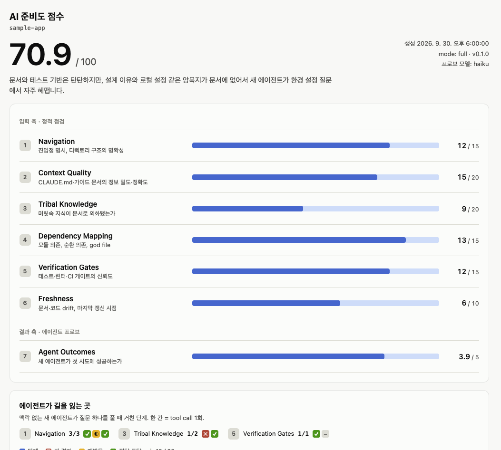
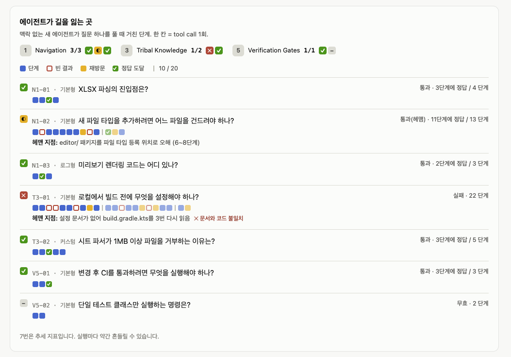

# ai-readiness-score

[English](README.md)

repo가 AI 코딩 에이전트와 일하기 좋은 상태인지 **7개 카테고리·100점**으로 채점하고, **에이전트가 어디서 길을 잃는지** 보여주는 [Claude Code](https://claude.com/claude-code) 스킬입니다.



## 무엇을 재나요

| # | 카테고리 | 배점 | 보는 것 |
|---|---|---|---|
| 1 | Navigation | 15 | 진입점이 드러나 있고 디렉토리 구조가 명확한가 |
| 2 | Context Quality | 20 | CLAUDE.md / AGENTS.md와 가이드 문서의 정보 밀도·정확도 |
| 3 | Tribal Knowledge | 20 | 사람 머릿속에만 있던 지식이 문서로 옮겨졌는가 |
| 4 | Dependency Mapping | 15 | 모듈 경계가 분명하고 순환 의존·god file이 없는가 |
| 5 | Verification Gates | 15 | 에이전트가 스스로 검증할 수 있는가 (테스트·린터·CI) |
| 6 | Freshness | 10 | 문서가 지금의 코드와 맞는가 |
| 7 | Agent Outcomes | 5 | 새 에이전트가 첫 시도에 성공하는가 |

1~6번은 에이전트가 기대는 **입력**을 점검합니다. 스크립트가 사실을 모읍니다: 문서, 명령어, CI, 문서 속 죽은 경로, 변경 빈도, 파일 크기, import 그래프. 그다음 Claude가 채점 기준(rubric)에 따라 점수를 매기고, 모든 점수에 근거를 붙입니다.

7번은 **결과**를 점검합니다. 맥락이 전혀 없는 `haiku` 서브에이전트들이 repo에 관한 실제 질문을 풀고, 대시보드는 그 에이전트들이 거친 단계를 전부 보여줘요. 어디서 헛발질했는지, 같은 파일을 다시 열었는지, 언제 정답에 닿았는지 한눈에 보입니다.



## 요구 사항

- Claude Code
- Python 3.8+ (표준 라이브러리만 사용, `pip install` 필요 없음)
- git (권장. 없으면 날짜 정보를 파일 수정 시각으로 대신 씁니다)
- Windows, macOS, Linux 지원

## 설치

스킬 본체는 `skills/ai-readiness-score` 폴더예요. repo를 clone한 뒤 이 폴더를 Claude 스킬 폴더에 링크합니다. 복사 대신 링크를 걸어두면 `git pull`만으로 업데이트돼요.

**macOS / Linux**
```bash
git clone https://github.com/werwer748/ai-readiness-score.git ~/ai-readiness-score
mkdir -p ~/.claude/skills
ln -s ~/ai-readiness-score/skills/ai-readiness-score ~/.claude/skills/ai-readiness-score
```

**Windows (PowerShell)**: 디렉토리 junction은 관리자 권한 없이 만들 수 있어요.
```powershell
git clone https://github.com/werwer748/ai-readiness-score.git $HOME\ai-readiness-score
New-Item -ItemType Directory -Force $HOME\.claude\skills | Out-Null
New-Item -ItemType Junction -Path $HOME\.claude\skills\ai-readiness-score -Target $HOME\ai-readiness-score\skills\ai-readiness-score
```

또는 `skills/ai-readiness-score` 폴더를 `~/.claude/skills/`(모든 프로젝트)나 특정 프로젝트의 `.claude/skills/`(그 프로젝트만)에 복사해도 됩니다.

## 사용법

채점할 repo에서 Claude Code를 열고:

```
/ai-readiness-score              # 전체 실행 (현재 폴더)
/ai-readiness-score quick        # 에이전트 프로브 생략 (95점 만점)
/ai-readiness-score ../other-repo
```

그냥 말로 해도 돼요: *"이 repo AI 준비도 점수 매겨줘"*, *"CLAUDE.md가 에이전트한테 괜찮은지 봐줘"*, *"에이전트가 왜 자꾸 이 코드베이스에서 헤매지?"*

채팅에는 짧은 요약이 나오고, 대시보드는 repo 바깥에 저장됩니다:

```
~/.claude/ai-readiness/<repo이름>-<해시>/report.html   (score.json 포함)
```

스킬은 채점하는 repo를 절대 수정하지 않아요.

## Agent Outcomes 프로브는 이렇게 동작해요

- **프로브 구성.** 1~5번 카테고리마다 템플릿 기반 **기본 프로브 3개**에 **추가 프로브를 최대 7개** 붙입니다. 추가 프로브는 커스텀 프로브를 먼저 채우고, 남는 자리는 이 repo에서 했던 Claude Code 세션 기록으로 만든 질문으로 채워요. 로그형 개수는 기록이 두 배로 늘 때마다 하나씩, `min(7, floor(log2(n+1)))`으로 천천히 늘어납니다. 기록이 없으면 15개, 최대 50개예요.
- **누가 푸나요.** 각 프로브는 읽기 전용 `Explore` 서브에이전트가 `haiku` 모델로 풉니다. 받는 건 질문과 repo 경로뿐이에요. 가벼운 모델을 쓰니 평가가 보수적입니다. haiku가 찾으면 더 강한 에이전트도 찾아요.
- **채점.** 정답이고 10단계 안에 정답에 닿으면 **통과**, 11~20단계면 **헤맴(0.5점)**, 틀리거나 20단계를 넘으면 **실패**입니다. 단계 수는 에이전트의 자기 보고가 아니라 서브에이전트 기록(transcript)에서 셉니다. 7번 점수 = 5 × (카테고리별 통과율의 평균).
- **비용.** 전체 실행은 몇 분 걸리고 토큰도 어느 정도 씁니다(프로브는 10개씩 병렬 실행). 예를 들어 파일 108개짜리 repo에서 프로브 20개로 약 11분, 작은 repo의 `quick` 실행은 약 1.5분이 걸렸어요. 정적 점수만 필요하면 `quick`을 쓰세요.
- **7번은 추세로 봐주세요.** 실행할 때마다 조금씩 흔들립니다.

### 커스텀 프로브

신입(과 에이전트)이 자주 틀리는 질문을 repo의 `.ai-readiness/probes.md`에 커밋해 두면 됩니다:

```markdown
## 1 새 스프레드시트 포맷은 어디에 등록하나요?
expected: src/format/SpreadsheetFormat.kt, src/main/resources/META-INF/plugin.xml

## 5 파서 테스트만 돌리려면?
expected: ./gradlew test --tests "*Reader*"
```

맨 앞 숫자는 카테고리(1~5)예요. 프로브 에이전트에게는 이 파일을 읽지 말라고 지시하고, 읽은 프로브는 점수에서 뺍니다.

## 개인정보

- 세션 기록은 **이 컴퓨터에서만** Claude Code 설정 폴더에서 읽어요. 작업 폴더가 채점 대상 repo인 최근 90일 프롬프트만 쓰고, 이 스킬을 실행했던 세션은 건너뜁니다.
- 원래 프롬프트는 리포트에 절대 들어가지 않아요. 로그에서 뽑은 질문은 일반화한 문장으로 바꿔 씁니다.
- 리포트는 repo 바깥에 저장되니 실수로 커밋될 일이 없습니다.

## 한계

- import 분석은 정규식 수준이고 JS/TS, Python, Go, Java, Kotlin을 지원해요. 그 외 언어는 샘플을 읽어 판단합니다.
- 1~6번 채점과 프로브 정답 판정에는 LLM 판단이 들어갑니다. 세기와 계산은 스크립트가 해서 실행 간 비교가 가능하지만, 약간의 편차는 있어요.
- 보조 스크립트는 CI에서 Windows·macOS·Linux로 테스트합니다. 스킬 전체 흐름은 macOS에서 검증했어요.

## 업데이트

```bash
git -C ~/ai-readiness-score pull        # Windows: git -C $HOME\ai-readiness-score pull
```

변경 내역은 [CHANGELOG.md](CHANGELOG.md)에 있어요. 채점 기준이 바뀌면 적어도 minor 버전을 올립니다. 버전이 다르면 점수를 그대로 비교할 수 없기 때문이에요. 각 `score.json`에는 그 점수를 만든 `skill_version`이 기록됩니다.

## 개발

```
skills/ai-readiness-score/
  SKILL.md                  # Claude가 따르는 실행 절차
  references/rubric.md      # 1~6번 채점 기준
  references/probes.md      # 프로브 템플릿, 서브에이전트 프롬프트, 채점 규칙
  references/schema.md      # score.json, 커스텀 프로브 형식
  scripts/                  # 스캔, 로그 추출, 단계 카운트, 렌더링 (stdlib만)
  assets/dashboard.html     # 리포트 템플릿 (외부 의존 없음)
tests/                      # python -m unittest discover -s tests
```

릴리스 순서: `CHANGELOG.md` 수정 → 커밋 → `git tag vX.Y.Z` → `git push --follow-tags`.

## 라이선스

[MIT](LICENSE)
