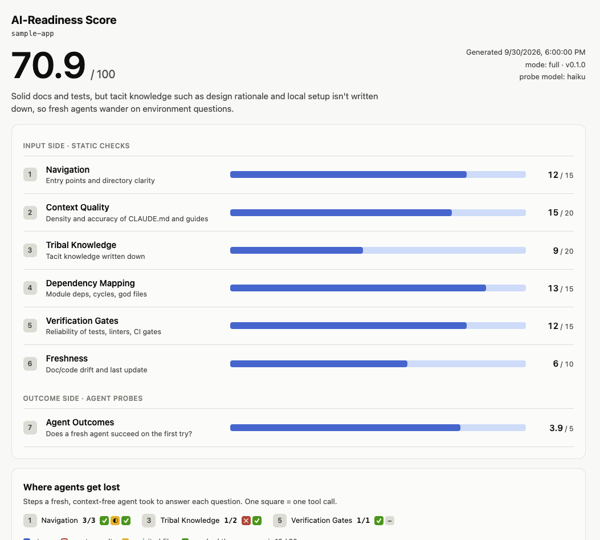
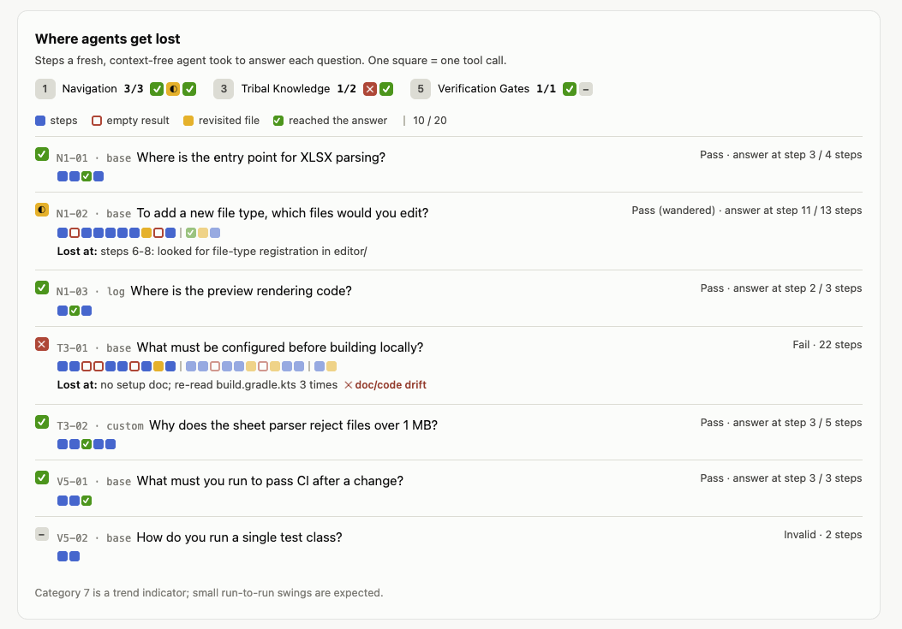

# ai-readiness-score

[한국어](README.ko.md)

A [Claude Code](https://claude.com/claude-code) skill that scores how ready a repository is for AI coding agents, on a 100-point, 7-category rubric, and shows you **where agents get lost**.



## What it measures

| # | Category | Points | Question |
|---|---|---|---|
| 1 | Navigation | 15 | Can an agent find entry points and know where things live? |
| 2 | Context Quality | 20 | Are CLAUDE.md / AGENTS.md and guides dense, specific and correct? |
| 3 | Tribal Knowledge | 20 | Is knowledge that lives in people's heads written down? |
| 4 | Dependency Mapping | 15 | Clear module boundaries, no cycles, no god files? |
| 5 | Verification Gates | 15 | Can an agent check its own work (tests, linters, CI)? |
| 6 | Freshness | 10 | Do the docs still match the code? |
| 7 | Agent Outcomes | 5 | Do fresh agents succeed on the first try? |

Categories 1-6 check the **inputs** an agent relies on. Scripts collect the facts: docs, commands, CI, dead references in docs, churn, file sizes and the import graph. Claude then scores them against a written rubric, with evidence for every point.

Category 7 checks the **outcome**. Fresh, context-free `haiku` subagents try to answer real questions about the repo, and the dashboard shows every step they took. You can see where each one hit a dead end, re-read a file, or reached the answer.



## Requirements

- Claude Code
- Python 3.8+ (standard library only; nothing to `pip install`)
- git (recommended; without it, dates fall back to file modification times)
- Windows, macOS or Linux

## Install

The skill is the `skills/ai-readiness-score` folder. Clone the repo and link that folder into your Claude skills directory. Linking (instead of copying) means `git pull` updates it.

**macOS / Linux**
```bash
git clone https://github.com/werwer748/ai-readiness-score.git ~/ai-readiness-score
mkdir -p ~/.claude/skills
ln -s ~/ai-readiness-score/skills/ai-readiness-score ~/.claude/skills/ai-readiness-score
```

**Windows (PowerShell)**: a directory junction needs no admin rights.
```powershell
git clone https://github.com/werwer748/ai-readiness-score.git $HOME\ai-readiness-score
New-Item -ItemType Directory -Force $HOME\.claude\skills | Out-Null
New-Item -ItemType Junction -Path $HOME\.claude\skills\ai-readiness-score -Target $HOME\ai-readiness-score\skills\ai-readiness-score
```

Alternatively, copy `skills/ai-readiness-score` into `~/.claude/skills/` (all projects) or into a project's `.claude/skills/` (that project only).

## Usage

In Claude Code, inside the repository you want to score:

```
/ai-readiness-score              # full run, current directory
/ai-readiness-score quick        # skip the agent probes (scored out of 95)
/ai-readiness-score ../other-repo
```

Or just ask: *"How AI-ready is this repo?"*, *"Grade our CLAUDE.md for agents"*, *"Why do agents keep getting lost in this codebase?"*

You get a short summary in the chat, and a dashboard saved outside the repo at:

```
~/.claude/ai-readiness/<repo-name>-<hash>/report.html   (and score.json)
```

The skill never modifies the repository it scores.

## How the Agent Outcomes probes work

- **Probe set.** Each of categories 1-5 gets **3 base probes** from templates, plus up to **7 extra**. Extras come first from your custom probes, then from questions derived from your own past Claude Code sessions in this repo. The number of log-derived probes grows slowly with how much history there is: `min(7, floor(log2(n+1)))`. A repo with no history gets 15 probes; the maximum is 50.
- **Who answers.** Each probe is a read-only `Explore` subagent running on `haiku`. It gets only the question and the repo path. A lighter model makes the test conservative: if haiku finds it, stronger agents will too.
- **Scoring.** A probe **passes** if it's correct and reaches the answer within 10 steps. It's **partial** if it needs 11-20 steps, and a **fail** if it's wrong or runs past 20. Steps are counted from the subagent transcripts, not self-reported. Category 7 = 5 × the mean of the per-category pass rates.
- **Cost.** A full run takes several minutes and uses some tokens; probes run 10 at a time. For example, a 108-file repo with 20 probes took about 11 minutes, and a `quick` run on a small repo took about 1.5 minutes. Use `quick` when you only want the static score.
- **Treat category 7 as a trend.** Results move a little from run to run.

### Custom probes

Commit `.ai-readiness/probes.md` to your repo with the questions newcomers (and agents) keep getting wrong:

```markdown
## 1 Where do we register a new spreadsheet format?
expected: src/format/SpreadsheetFormat.kt, src/main/resources/META-INF/plugin.xml

## 5 How do I run only the parser tests?
expected: ./gradlew test --tests "*Reader*"
```

The leading number is the category (1-5). Probe agents are told not to read this file, and a probe that does is excluded from the score.

## Privacy

- Session logs are read **locally**, from your Claude Code config directory: only prompts whose working directory is the scored repo, from the last 90 days. Sessions that ran this skill are skipped.
- Raw prompts are never written to the report. Log-derived questions are rewritten in general terms.
- Reports are stored outside the repo, so you won't commit them by accident.

## Limitations

- Import analysis is regex-level and covers JS/TS, Python, Go, Java and Kotlin. Other languages are judged by sampling.
- LLM judgment is involved in categories 1-6 and in grading probes. Scripts do the counting and arithmetic so runs stay comparable, but expect some variance.
- The helper scripts are tested on Windows, macOS and Linux in CI. The end-to-end skill flow has been exercised on macOS.

## Updating

```bash
git -C ~/ai-readiness-score pull        # Windows: git -C $HOME\ai-readiness-score pull
```

See [CHANGELOG.md](CHANGELOG.md). A rubric change bumps at least the minor version, because scores from different versions aren't directly comparable. Each `score.json` records the `skill_version` that produced it.

## Development

```
skills/ai-readiness-score/
  SKILL.md                  # the workflow Claude follows
  references/rubric.md      # scoring anchors for categories 1-6
  references/probes.md      # probe templates, subagent prompt, grading
  references/schema.md      # score.json and custom probe formats
  scripts/                  # scan, log extraction, step counting, rendering (stdlib only)
  assets/dashboard.html     # self-contained report template
tests/                      # python -m unittest discover -s tests
```

Release flow: update `CHANGELOG.md`, commit, `git tag vX.Y.Z`, `git push --follow-tags`.

## License

[MIT](LICENSE)
